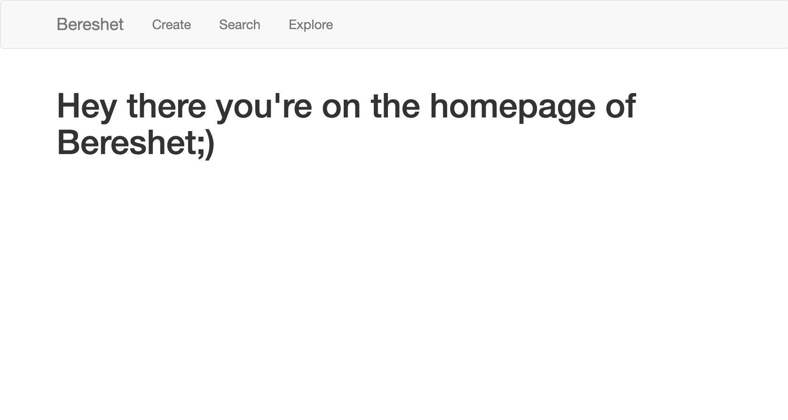

[](https://github.com/psf/black)

# Bereshet

description



## Why this name?

- reminds "Beresheet"
- Network
- Idea: something customizable, custom, but also hyper-connected, exploratory

## Functionalities

- [x] Create and explore Mechabrim (name, id)
- [ ] docs
- [ ] tests
- [x] formatting
- [ ] linting
- [ ] Create and explore Mekorot, Sefarim

## Install

### Python version

Using Python version 3.7.

### Install requirements

```
pip install -r requirements.txt  # install requirements
pre-commit install               # install pre-commit hooks
```

### Run test suite

```
instructions
```

## Run

### Adapt config

### Run app

```
FLASK_APP=bereshet:create_reshet flask run
```

## Design

### File tree structure

```
yam/
 |-config.py
 |-README.md
 |-requirements.txt
 |-run.sh
 |-setup.sh
 |-yam.py
 |-yam/
 |---__init__.py
 |---errors/
 |------__init__.py
 |------handlers.py
 |---main/
 |------__init__.py
 |------forms.py
 |------routes.py
 |---models/
 |------sheets.py
 |------authors.py
 |------sefarim.py
 |---templates/
 |------errors/
 |---------404.html
 |---------500.html
 |------base.html
 |------index.html
 |------search.html
 |------import.html
 |-tests/
 |---tests.py
 |-db/
 |---sheets.db
 |---authors.db
 |---sefarim.db
 |-docs/
 |-migrations/
 |---versions/
```

### OOP structure

### Database table diagrams/relations

## Contributions

First flask project, catered to my own needs and trying to put best software development practices in action. If you're interested, have any contributions, tips or suggestions, contact me (link!)
